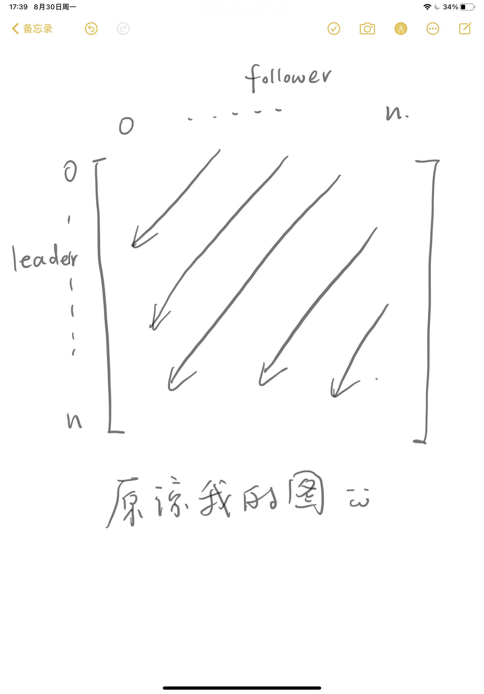

# Introduction

### Purpose: 
To identify the leaders and the 'mockingbirds' among traders.

### Method: 
Identifying similarities in trading patterns among different traders based on the time intervals between their trades.

---

> Assumption: 
The shorter the time interval between two similar and directionally identical trades, the higher the similarity of the "trade pair", and the more likely it is that the latter trade is imitating the former.

#### Category 1: By='ticker'
For each stock, earlier trades can potentially inspire subsequent ones. We assume that every trade is imitated by all following trades, with those closer in time having a higher likelihood of imitation. For any two trades (trade pair i & j) with the same ticker, we define the imitation tendency as follows.

#### Category 2: By='industry'
Imitators may not directly purchase the stocks bought by leaders but might buy stocks from the same industry, considering such follow-the-leader trades in an expanded category as similar strategies. Similarly, for any two trades (trade pair i & j) within the same industry, we define the imitation tendency.

> #### 1️⃣ Definition of Imitation Tendency for Idea Pairs:
>
> $$
> tendency_{ij} = \frac{1}{time_j-time_i}
> $$
>

For trades i & j, a smaller 'tendency' value indicates a lower probability of j following i, and vice versa. A 'tendency' greater than 1 implies that the time interval between the two trades is less than 24 hours. Note that 'time' is converted into whole days here.

Now, having a method to calculate the imitation tendency for all specified trade pairs, we can sum up all imitation tendencies from trader n to m for any creator pair m & n, deriving an index of relational closeness by creator:

> #### 2️⃣ Definition of Relational Closeness for Creator Pairs:
>
> $$
> Relationship_{nm} = \Sigma_{n,m\in C}Tendency_{ij}(i\in n,j \in m)
> $$
>

Note that this represents a directional relationship, suggesting the possibility of mutual imitation between two traders.

This results in a creators * creators square matrix, forming a directed graph. Each column of this matrix indicates the extent to which the creator in that column is influenced by others, while each row shows how much that creator influences others, indicating the degree to which they are imitated.

### Usage Instructions:

---

`relationship.relationshipmetrix(df, by):`

'df' is the list of ideas you need to input, containing at least creat_time, creator, ticker, and industry.

'by' is the category you need to specify. If by = 'ticker', the function searches for idea pairs among all trades with the same ticker. If by = 'industry', it finds idea pairs among trades within the same industry.

This function returns a pandas.DataFrame with creators as both rows and columns. The values indicate the degree of relational closeness as defined in 2️⃣.

### Potential Issues

---

1. The relationship in the idea pairs defined by this algorithm is not stable, as it is based on time intervals. However, many factors can influence time intervals, and a shorter interval does not necessarily mean a higher probability of imitation.
2. The same person might have executed multiple trades for the same ticker at different times. In calculating the 'tendency', the influence of similar trades by the same person is excluded, assuming one cannot be their own imitator.
3. Ongoing research.
